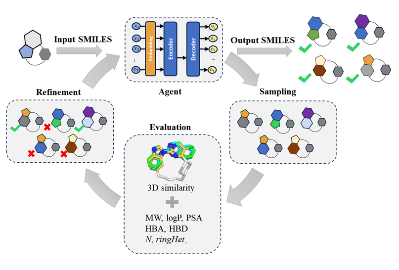

# Macro-hop
In order to be able to directly scaffold hopping of macrocyclic compounds, we constructed Macro-hop models based on Reinvent (https://github.com/MolecularAI/Reinvent). It allows for direct optimization of macrocyclic compounds by setting a scoring function and generates macrocyclic molecules with a specified number of ring atoms.



## Getting Started

### Installation
-------------
1. Set up conda environment and clone the github repo
2. Open a shell, and go to the repository and create the Conda environment:
```
$ conda env create -f environment.yaml
$ conda activate Macro-hop
$ cd reinvent_functions
$ pip install reinvent_function-0.0.8.1-py3-none-any.whl
```

### System Requirements
- Cuda-enabled GPU
- Linux

## Analyse the results

1. tensorboard --logdir "progress.log"

    progress.log is the "logging_path" in template.json
